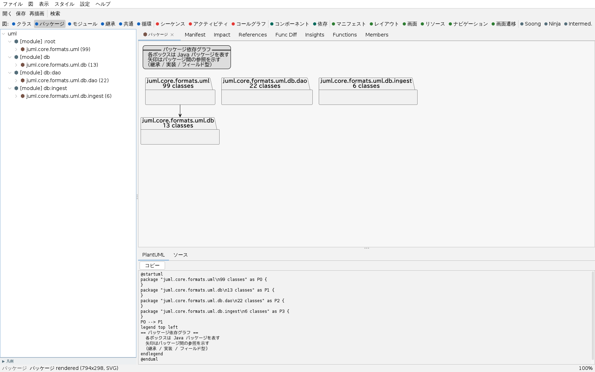
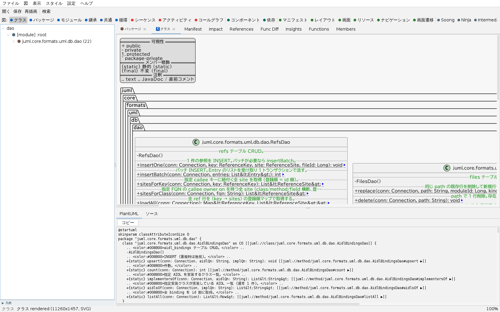

Juml 2.0 — Java + Android + Gradle UML Tool
================================================

[](LICENSE)



> Juml の GUI。自分自身のソース (`juml.core.formats.uml`) を解析し、パッケージ依存図を表示している様子。
> 左にプロジェクトツリー、上に図種切替ツールバー、右に図、下に生成 PlantUML ソースが並ぶ。

概要
------------------------------------------------
Juml は **Java / Android (Gradle + AndroidManifest.xml + AIDL) プロジェクトから
UML 図を生成する Swing ベース + CLI のツール**です。同梱の PlantUML (Smetana レイアウト) で
描画するため、Graphviz / PlantUML の追加インストールは不要です。

* **生成できる図**: クラス図 / パッケージ図 / シーケンス図 / アクティビティ図 / 共通クラス図 /
  コンポーネント図 / Manifest 図 / Gradle 依存図 / Soong 図 (Android.bp) /
  APK (smali) クラス図・シーケンス図 (Apktool 逆コンパイル出力) など全 17 種
* **動作環境**: Java 17 以上 (JRE / JDK)。Windows / macOS / Linux で動作確認
* **GUI と CLI の両対応**: 対話的にプレビューする GUI と、図を一括書き出す CLI を同梱

> 1.7 までは PAD (Problem Analysis Diagram) ツールでしたが、2.0 で
> Java + Android + Gradle 特化の UML ツールに完全転換しました。旧 PAD / SPD 機能は廃止されています。

クイックスタート
------------------------------------------------

```sh
# GUI を起動 (引数にプロジェクトを渡すと起動時に解析)
java -jar Juml.jar ~/AndroidStudioProjects/MyApp

# CLI でクラス図を SVG 出力
java -jar Juml.jar -c -o class.svg ~/AndroidStudioProjects/MyApp

# 全成果物を一括出力
java -jar Juml.jar --all -o ./out ~/AndroidStudioProjects/MyApp

# アーキテクチャ俯瞰レポート (エントリポイント / ホットスポット /
# パッケージ循環依存 / デッドコード候補 / 推定レイヤ) + 循環図を出力
java -jar Juml.jar --insights -o ./insights ~/AndroidStudioProjects/MyApp

# APK を図化 (ソース不要)。同梱 Apktool が .apk を自動で逆コンパイルする
java -jar Juml.jar --apk -o ./apkout app.apk
#   既に `apktool d app.apk -o ./decoded` で展開済みなら、そのディレクトリも渡せる
java -jar Juml.jar --apk -o ./apkout ./decoded

# APK の smali を「見る」: 逆コンパイルのみ / クラス別構造 / 処理フローのシーケンス図
java -jar Juml.jar --apk-decode   -o ./decoded app.apk          # smali ファイルを展開
java -jar Juml.jar --apk-smali    -o smali.md  app.apk          # クラス別構造を Markdown
java -jar Juml.jar --apk-sequence com.example.MainActivity.onClick -o seq.svg app.apk
```

GUI の操作、CLI の全オプション、各図種の詳細、ビルド方法、既知の制約などは
下記ドキュメントにまとめています。

GUI（グラフィカル UI）
------------------------------------------------
引数なし、またはプロジェクト/APK/jar を渡して起動すると、解析結果を対話的に
プレビューできる Swing GUI が立ち上がります。FlatLaf による Light / Dark テーマ、
日本語 / 英語 UI に対応しています。



> クラス図の表示例。クラスのメソッド・フィールドを可視性 (`+ public` / `- private` …) 付きで描き、
> JavaDoc やパッケージ階層 (`juml › core › formats › uml › db › dao`) も枠として可視化する。

画面構成と主な機能:

* **左ペイン — プロジェクトツリー**: モジュール / パッケージ / クラス / メソッドを
  ツリー表示。ノードをダブルクリックすると、その対象の図をタブで開きます。
* **図種ツールバー**: クラス / パッケージ / モジュール / 継承 / 共通 / 循環 /
  シーケンス / アクティビティ / コールグラフ / コンポーネント / 依存 / マニフェスト /
  レイアウト / 画面 / Soong / Ninja などの図種をワンクリックで切り替え。
* **右ペイン — タブ**: VS Code のエディタのように、複数の図を対等なタブとして並行表示。
  同じ題材・図種のタブは重複生成せず既存タブにフォーカスします。
* **解析タブ**: Manifest / Impact（影響波及）/ References（逆参照）/ Func Diff /
  Insights（アーキテクチャ俯瞰）/ Doxygen / TODO / Groups / Functions / Members を切り替えて参照可能。
* **Doxygen 連携**: 外部の doxygen を回して生成 XML を取り込み、API リファレンス（説明文・
  `@param`/`@return`/`@throws`・継承/参照）を「Doxygen」タブで、`@todo`/`@bug`/`@deprecated` の
  横断一覧を「TODO」タブで、`@defgroup` グループ階層を「Groups」タブで表示します。doxygen が
  PATH に無い場合は各タブの「Locate doxygen…」で実行ファイルを指定でき、解析結果は
  ソース無変更時にキャッシュを再利用します（同梱は `bundle/doxygen/<platform>/` 経由）。
* **PlantUML / ソースビュー**: 図の下に生成 PlantUML ソースと、対応する Java ソースを表示。
  PlantUML はワンクリックでコピーできます。
* **プレビュー操作**: ベクター SVG で描画し、ズーム / パン、クラス図のメソッドから
  シーケンス図へのドリルダウン、スコープ（表示範囲）の絞り込み、エンティティ検索に対応。
* **エクスポート**: 図を SVG / PNG / PlantUML として保存（右クリックや「保存」ボタン）。
  フォルダごとのクラス図一括出力も可能です。

> 巨大な図が描画できないときは、GUI の `図 → Enable Graphviz (dot)…` から Graphviz を
> 有効化できます（詳細は [GUI 操作マニュアル](docs/gui-manual.html)）。

exe を作る（jpackage で自己完結ネイティブイメージ）
------------------------------------------------
`java -jar` で起動できる fat jar に加えて、**JRE を同梱し Java 未インストールでも
起動できるネイティブイメージ（Windows なら `Juml.exe`）** を JDK 標準の jpackage で
生成できます。Gradle タスクを用意済みです。

```sh
# JRE 同梱の app-image を build/jpackage/Juml/ に生成
./gradlew jpackageImage

# 生成した app-image を OS 別サフィックス付き ZIP に固める
#   -> build/distributions/Juml-<os>-<version>.zip
./gradlew jpackageZip
```

* **前提**: jpackage は JRE には含まれないため、**JDK 17 以上**が必要です。
  `JAVA_HOME` を JDK に向けてから実行してください（JRE だとタスクが明示エラーになります）。
* **生成物（実行したホスト OS 向けのみ作られます）**:

  | 実行 OS | 生成物 |
  |---|---|
  | Windows | `build/jpackage/Juml/Juml.exe`（+ `runtime\`）。`other/juml.ico` をアイコンとして埋め込み |
  | Linux | `build/jpackage/Juml/bin/Juml`（+ `lib/runtime/`） |
  | macOS | `build/jpackage/Juml.app` |

* **重要 — クロスビルド不可**: jpackage は「実行している OS 向け」のイメージしか作れません。
  配布用の Windows `.exe` は **Windows 上で生成**してください。CI では
  [`.github/workflows/release.yml`](.github/workflows/release.yml) の `package-windows`
  ジョブが `windows-latest` ランナーで `jpackageZip` を実行し、`Juml-windows-*.zip` を
  GitHub Release に自動添付します。
* 生成された `Juml.exe`（Windows）/ `Juml`（Linux）/ `Juml.app`（macOS）を起動すれば、
  別途 Java を入れずに GUI が立ち上がります。

ドキュメント
------------------------------------------------
詳細なドキュメントは [`docs/`](docs/) に **HTML** で置いており、**GitHub Pages で <https://nigoh.github.io/Juml/> に公開されます**。

* [ドキュメントトップ](https://nigoh.github.io/Juml/) — 概要・GUI マニュアル・開発者リファレンスへの入口
* [プロジェクト概要](docs/project-summary.html) — 何ができるか・構成・ビルド・主要依存ライブラリ
* [操作マニュアル](docs/operation-manual.html) — **入手・インストール (exe / jar / ビルド) から GUI・CLI の実運用までを一気通貫**で解説（少しコーディングできる人向け）
* [GUI 操作マニュアル](docs/gui-manual.html) — 起動・ツールバー・各図種の操作・スタイル設定・ショートカット・**巨大な図が描画できないときの対処**
* [開発者リファレンス](docs/developer-reference.html) — CLI 全フラグ・図種カタログ・GUI 内部・解析エンジン・**解析対象と既知の制約**
* [Claude Code 連携](docs/claude-code.html) — `.claude/` 配下のエージェント・スキル・スラッシュコマンド (AOSP / AAOS 解析・Java 解析エンジン) のカタログと使い方
* [Claude エージェント / スキル導入手順](.claude/SETUP_CLAUDE_AGENTS_SKILLS.md) — 上記の Claude Code エージェント・スキルをユーザホーム `~/.claude/` に配置する手順

オープンソースについて
------------------------------------------------
本プロジェクトは **MIT ライセンスで公開されているオープンソースソフトウェア (OSS)** です。
ソースコードは GitHub ([nigoh/juml](https://github.com/nigoh/juml)) で公開しており、
誰でも自由に利用・改変・再配布できます。バグ報告や Pull Request も歓迎します。

セキュリティ
------------------------------------------------

### 設計上の安全対策

Juml は**ローカルプロジェクトのソースコードを読み取るだけ**のツールであり、
ネットワーク通信・外部サービスへの送信・コード実行は一切行いません。
入力となる Java / AIDL / AndroidManifest.xml / Gradle ファイルはすべてローカルディスク上にあります。

> **APK 逆コンパイルについて**: `--apk*` モードで `.apk` を渡すと、同梱の Apktool
> (`apktool-lib`) を **JVM 内のライブラリ呼び出しとして** 実行して逆コンパイルします。
> `aapt` 等の外部プロセス起動やネットワークアクセスは行わず (decode は純 Java)、
> APK 内の DEX を **実行せず逆アセンブル (baksmali) するだけ** です。展開結果は
> 一時ディレクトリに書き出されます。信頼できない APK を扱う際の一般的注意は
> 下記「ユーザーへの注意事項」を参照してください。

主なセキュリティ対策:

| 対象 | 対策 |
|---|---|
| XML パース (AndroidManifest / Preferences / Layout XML) | XXE (外部エンティティ参照) を全パーサで無効化。`disallow-doctype-decl` / `external-general-entities` / `external-parameter-entities` / `setXIncludeAware(false)` / `setExpandEntityReferences(false)` を設定 |
| PlantUML カスタム skinparam | `!include` / `!pragma` 等のプリプロセッサ系ディレクティブをフィルタしてからレンダラに渡す |
| DB 保存済みの相対パス解決 | `getCanonicalFile()` でプロジェクトルート外への逸脱 (パストラバーサル) を検出・拒否 |
| GUI の HTML 表示 | プロジェクト名・パスを Swing HTML に埋め込む前に `&amp;` / `&lt;` / `&gt;` をエスケープ |
| SQL | すべての動的値は `PreparedStatement` のバインドパラメータ (`?`) 経由 |
| プロセス起動 | `Runtime.exec()` / `ProcessBuilder` を Juml 本体から直接呼び出さない。Graphviz 実行は PlantUML ライブラリに委譲 |
| デシリアライズ | `ObjectInputStream` / `readObject()` を一切使用しない。設定は Properties XML、索引は SQLite で永続化 |
| ハードコード秘密情報 | API キー・パスワード・トークンをコード内に埋め込まない |

### ユーザーへの注意事項

* **信頼できないプロジェクトを開く場合**: 悪意ある XML ファイルや AIDL ファイルが含まれる可能性があります。上記の対策を施していますが、未知の脆弱性の可能性はゼロではありません。
* **Custom Skinparam**: Style Settings の「Custom Skinparam」フィールドは PlantUML の `skinparam` 命令のみを受け付けます。ファイル読み込み系のディレクティブ (`!include` 等) は自動的に除去されます。
* **依存ライブラリ**: 同梱の PlantUML / Apache Batik 等に既知 CVE が公開された場合は、最新の fat jar をビルドし直してください (`./gradlew jar`)。

### 脆弱性の報告

セキュリティ上の問題を発見した場合は、公開 Issue ではなく
**GitHub の [Security Advisories](https://github.com/nigoh/juml/security/advisories/new)**
からご報告ください。

ライセンス
------------------------------------------------
Juml は **オープンソースソフトウェア** として MIT ライセンスのもとで公開されています。

    Copyright (c) 2015-2026 naou and contributors

    Released under the MIT license (http://opensource.org/licenses/mit-license)

MIT ライセンスは [OSI (Open Source Initiative)](https://opensource.org/licenses/MIT) が
承認したオープンソースライセンスで、商用・非商用を問わず自由に利用・改変・再配布が可能です
(著作権表示とライセンス文の保持が条件)。ライセンス全文はリポジトリ直下の
[`LICENSE`](LICENSE) を参照してください。

同梱の PlantUML は MIT 版アーティファクト (`plantuml-mit`) を使用しており、配布される
fat jar 全体が MIT 互換です。fat jar に同梱される第三者ライブラリとそのライセンスの
一覧は [`THIRD-PARTY-NOTICES.md`](THIRD-PARTY-NOTICES.md) を参照してください。

リンク
------------------------------------------------
* GitHub [https://github.com/nigoh/juml](https://github.com/nigoh/juml)
* ドキュメント [https://nigoh.github.io/Juml/](https://nigoh.github.io/Juml/)
</content>
</invoke>
